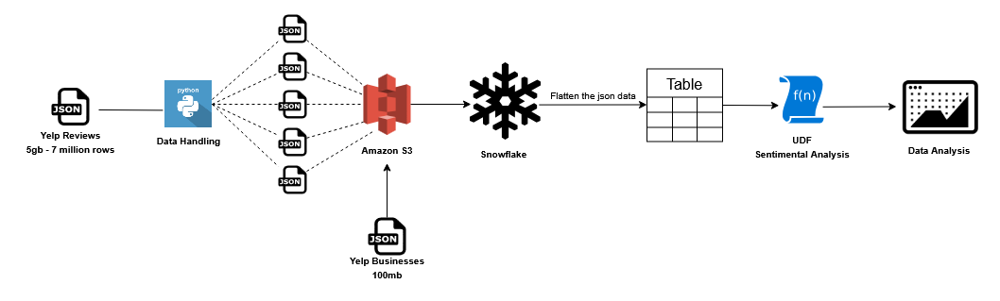
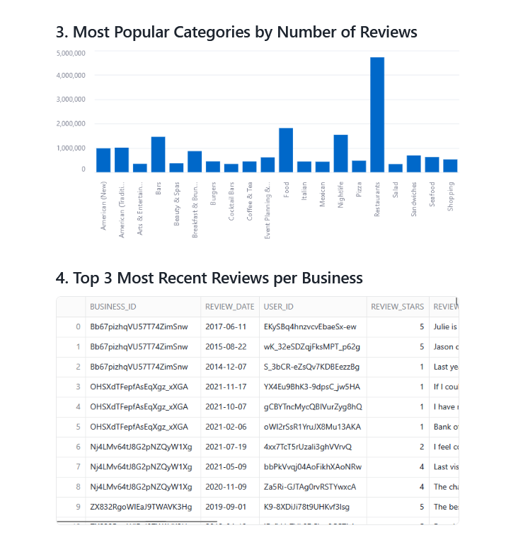

# 📊 Yelp Review Sentiment Analysis using Snowflake

This project performs large-scale sentiment analysis on Yelp reviews using tools like Snowflake and Amazon S3, with preprocessing handled via Python.

## 🧩 Workflow

1. **Data Handling**  
   - Load Yelp reviews (~5GB, ~7 million rows) and business data (~100MB) in JSON format.  
   - Use Python to process and split the JSON files into manageable chunks.

2. **Cloud Storage**  
   - Upload processed JSON chunks to Amazon S3.

3. **Snowflake Integration**  
   - Load JSON data from S3 into Snowflake.  
   - Use Snowflake to normalize nested JSON structures into tabular format.

4. **Sentiment Analysis**  
   - Apply a custom Snowflake **User-Defined Function (UDF)** to analyze the sentiment of each review.

5. **Data Analysis & Visualization**  
   - Run SQL queries and generate visualizations to uncover patterns, trends, and insights in customer sentiment using Streamlit.

---

## 📁 Datasets Used
https://business.yelp.com/data/resources/open-dataset/

---

## 📈 Outcome
Gain insights into customer sentiment and business trends using a scalable, cloud-based pipeline optimized for handling large volumes of semi-structured data.

